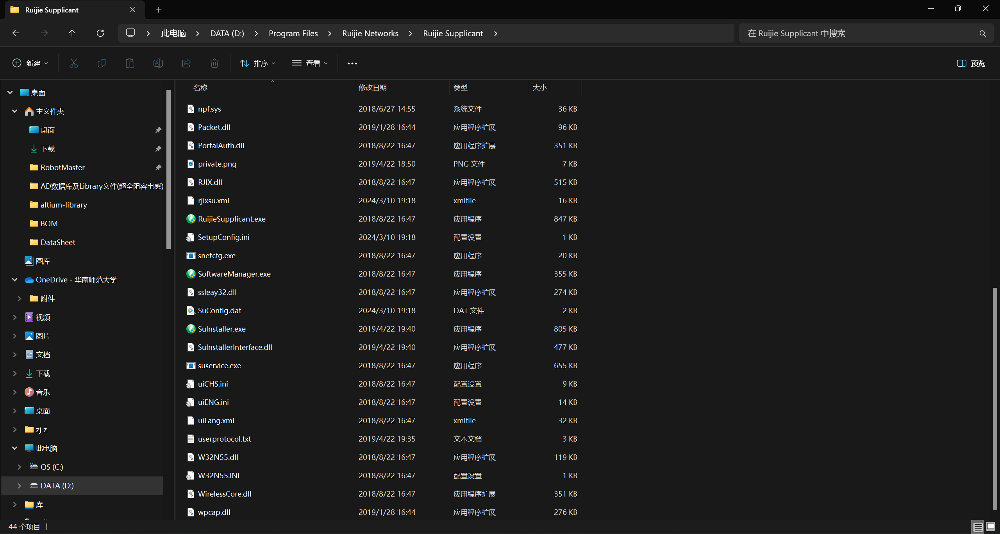
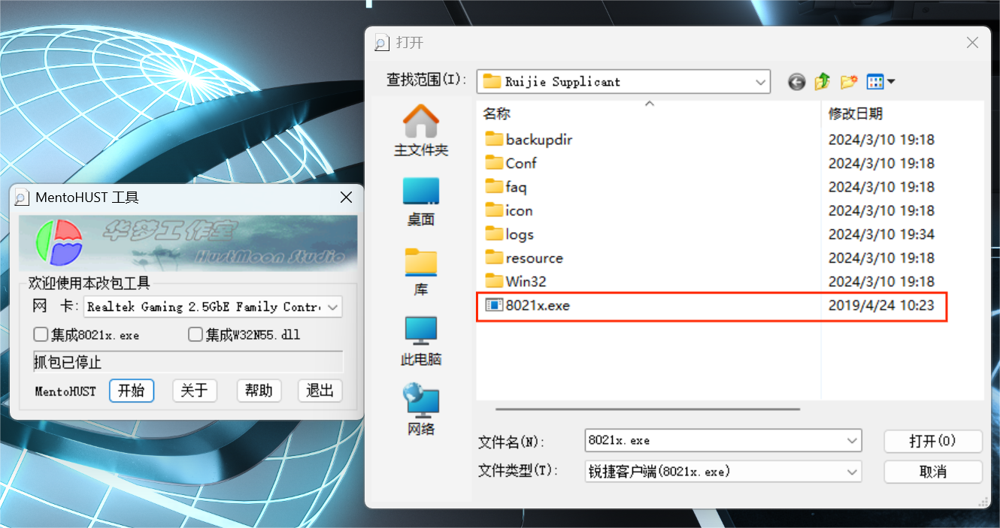
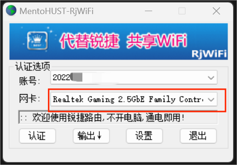
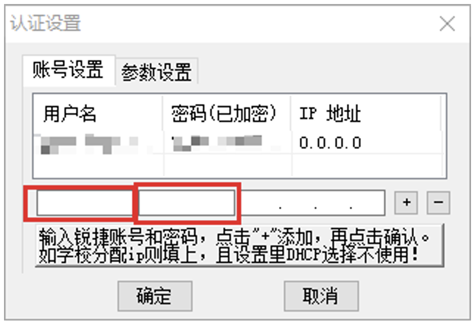
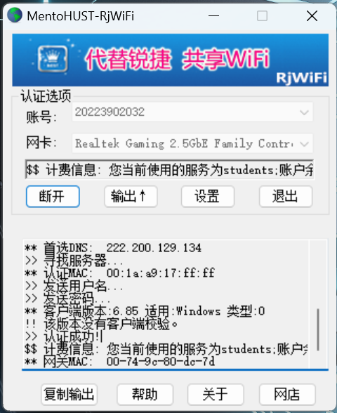
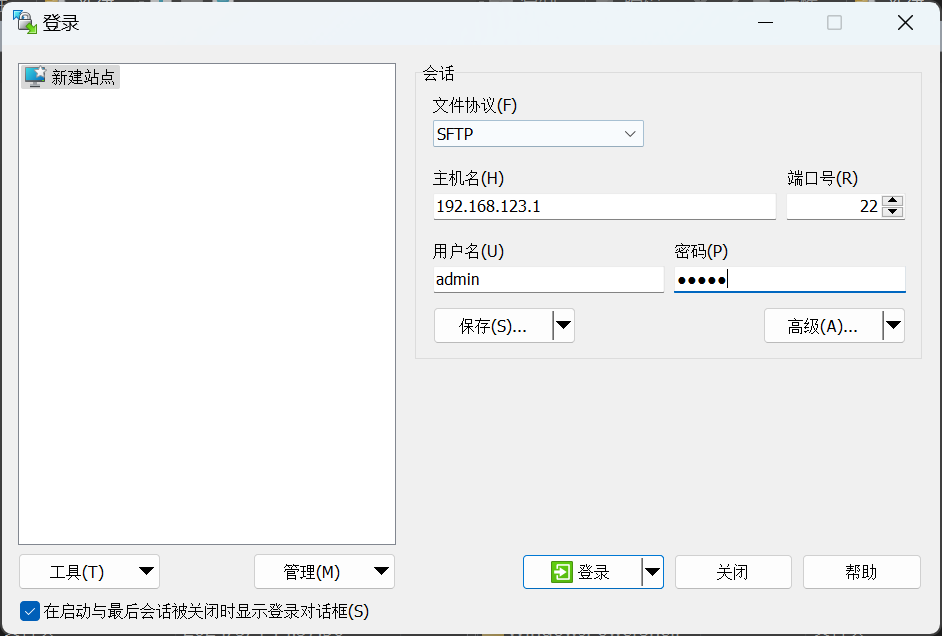
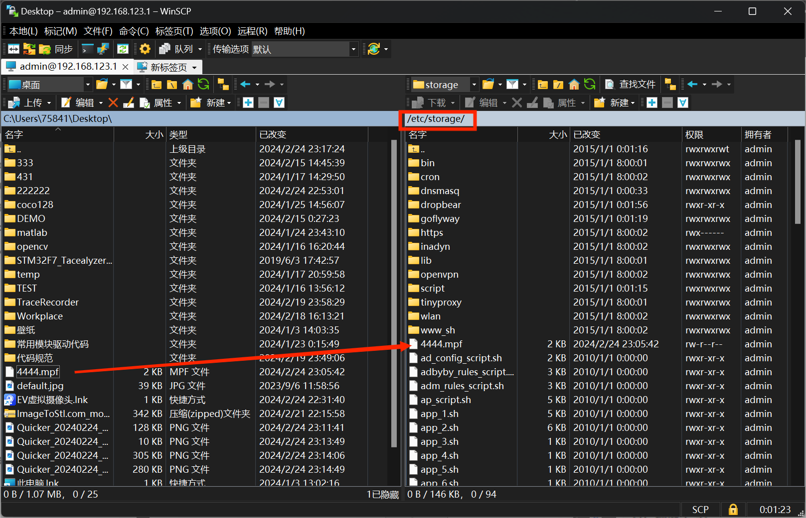
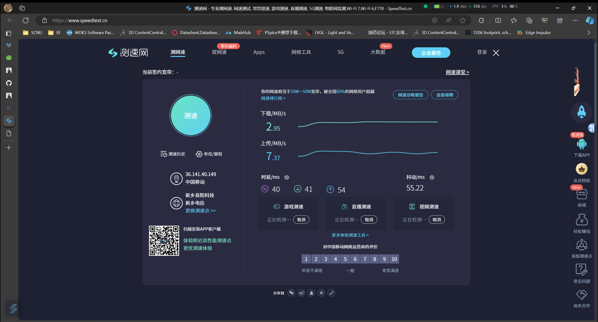

# XiaomiRouter4-Pandavan

## 测试环境

- Windows11 23H2 专业版
- Python环境 `3.11.5`
- 小米路由器4（Pandavan固件版本`3.4.3.9-099_22-01-4`）
- 锐捷客户端`V6.85`

## 准备工作

- 刷机准备
  - 对应路由器的**Breed**固件 **[（点此查找Breed固件）](https://breed.hackpascal.net/)**
      ***注意：不同型号的路由器对应的Breed固件不同，切记不要乱刷导致路由器变砖！！！***
  - 对应路由器的**Pandavan**固件 **[（点此查找Pandavan固件）](https://opt.cn2qq.com/padavan/)**
- 伪装Mac准备
  - 锐捷客户端
  - WinSCP

## 向路由器刷入Breed&Pandavan固件

- 由于大多数博客或者视频网站都有路由器刷**Breed&Pandavan**的相关教程，这里就不再赘述。（[推荐教程](https://www.bilibili.com/video/BV1wq4y1c7Sc?vd_source=9299b0597ba8d6f604011de5638a2748)）**视频所附文件均已上传GitHub!!!**

## 获取伪装的Mac地址

- 安装锐捷客户端（这里需要记录软件安装路径,比如我的安装路径为`D:\Program Files\Ruijie Networks\Ruijie Supplicant`，如下图所示：）

- 安装WinPcap（`WinPcap 4.1.3.exe`），然后运行抓包工具（`MentoHUST.exe`），将网卡选择为电脑有线网口绑定的网卡，如下图所示：

- 点击开始，手动查找锐捷客户端程序位置（教程所述安装位置为`D:\Program Files\Ruijie Networks\Ruijie Supplicant`），然后登陆我们校园网账号密码进行登录,保存后缀为`mpf`的文件。

- 打开我们的测试软件（`test.exe`），依然将网卡选择为电脑有线网口绑定的网卡；点击**设置**，填写账号密码，点击+号保存；打开**参数设置**，导入我们所抓的数据包；然后点击**确认**进行认证；如图：

***我们需要保存的是***

## 路由器配置

- 打开WinScp软件（这里提供安装和免安装版本，可自由选择），填入我们路由器的登录信息，如图：

- 将抓到的数据包放入`/etc/storage`这个路径下

- 打开浏览器，输入`192.168.123.1`，登录账号：`admin`，密码：`admin`，打开**外部网络**，再打开**锐捷认证**，填入我们在上一步获取到的信息。
***注意：不同作者编译的Pandavan固件所对应的路由器IP地址和登录后台的管理员账号密码可能不一样，以作者的说明为准***

## 网速测试

- 直连校园网测速：

- 路由器测速：

**最后，enjoy it😁😁😁**

